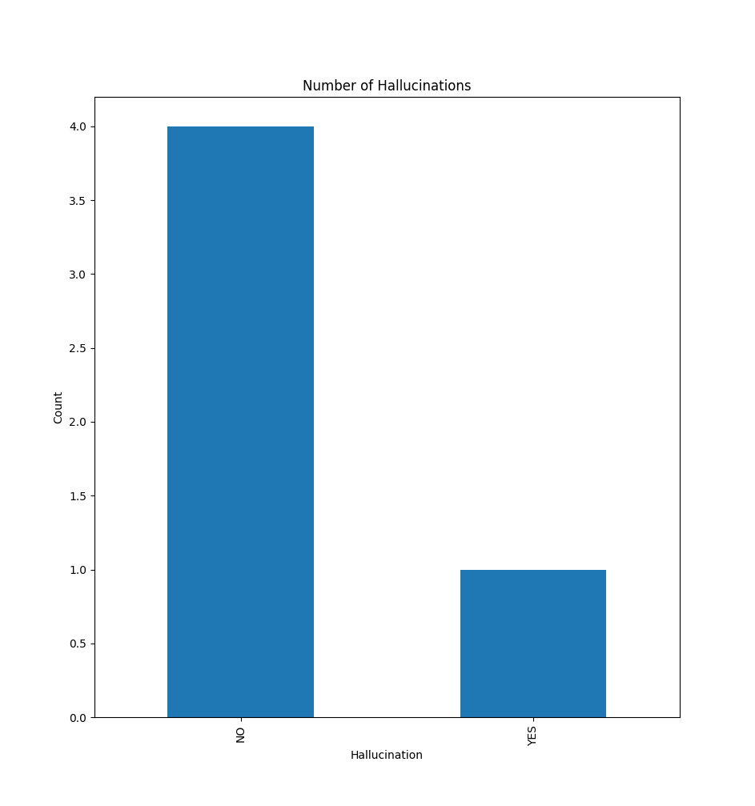
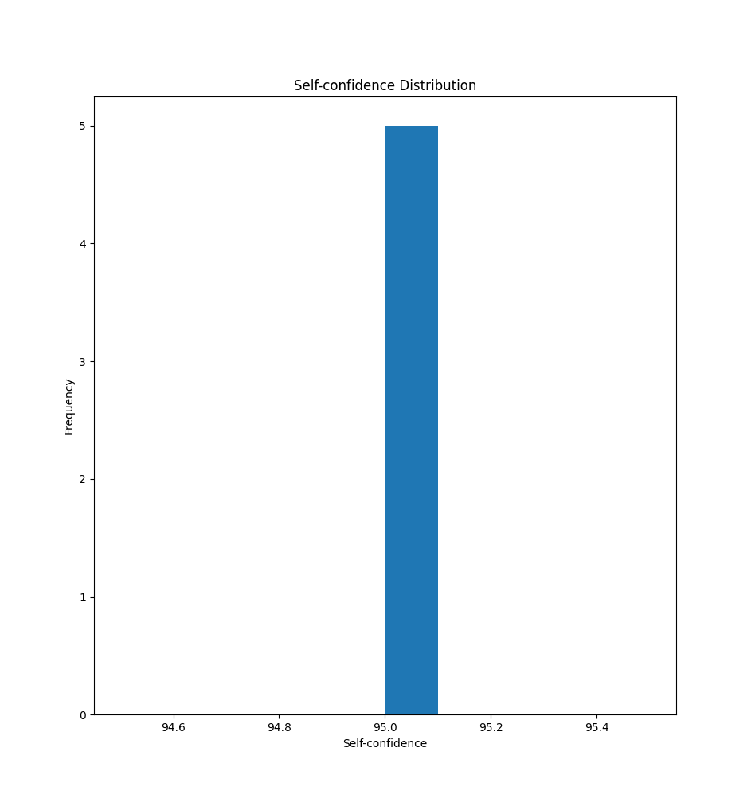

# 📄 Apana LLM Evaluation System

## 🎯 Project Overview

This project implements a complete evaluation pipeline for assessing a **French financial domain language model**, as part of the Apana technical challenge.

It includes:

- Automated response generation (Gemini)
- Rich evaluation metrics
- Regulatory compliance checks
- Interactive analysis capabilities
- Visual performance reporting

---

## 🛠️ Project Structure

```

llm-eval-apana/
├── data/
│   └── eval\_set.json          # Evaluation dataset
├── src/
│   ├── generate.py            # Response generation logic
│   └── evaluate.py            # Metrics computation
├── output/                    # Evaluation results CSVs
├── run\_eval.py                # Main evaluation runner
├── requirements.txt           # Dependencies
├── .env.template              # Environment variable template
└── README.md                  # This file

````

---

## 🚀 How to Run

1️⃣ **Install dependencies**

```bash
pip install -r requirements.txt
````

2️⃣ **Configure environment variables**

Create a `.env` file:

```
GOOGLE_API_KEY=your_gemini_api_key
LANGCHAIN_API_KEY=your_langsmith_api_key
LANGCHAIN_PROJECT=apana-llm-eval
LANGCHAIN_TRACING_V2=true
```

3️⃣ **Run the evaluation**

```bash
python run_eval.py
```

---

## ✅ Implemented Features

**1. Dataset Loading**

* Loads prompts and reference answers from `data/eval_set.json`.

**2. Response Generation**

* Gemini 1.5 Flash model via LangChain.
* Custom financial system prompt for domain accuracy.

**3. Evaluation Metrics**

* Cosine similarity
* Keyword overlap
* BLEU score
* ROUGE-1 / ROUGE-2 / ROUGE-L
* LLM-Judge score (0–10 scale)
* Self-confidence estimation (0–100)
* Hallucination detection + rationale
* Regulatory compliance check (keywords: *AMF*, *ACPR*, etc.)

**4. Result Logging**

* CSV export to `/output`.
* Optional LangSmith logging for advanced review.

---

## 📊 Evaluation Summary

| Metric                    | Description                                       |
| ------------------------- | ------------------------------------------------- |
| **Cosine Similarity**     | Embedding similarity with reference               |
| **Keyword Overlap**       | Token overlap ratio                               |
| **BLEU Score**            | N-gram similarity                                 |
| **ROUGE Scores**          | Overlap of n-grams and longest common subsequence |
| **LLM-Judge Score**       | Gemini-evaluated quality score                    |
| **Self-confidence**       | Model's self-reported confidence                  |
| **Regulatory Compliance** | Presence of regulatory keywords                   |
| **Hallucination Flag**    | Whether content likely contains hallucination     |
| **Hallucination Reason**  | Explanation of hallucination or correctness       |

---

## 🖼️ Evaluation Visuals

Below are key charts generated from results:

**1️⃣ Number of Hallucinations**



**2️⃣ Self-confidence Distribution**



**3️⃣ BLEU vs. Similarity Scatter Plot**


---

## 🧠 How to Interpret

* **BLEU vs Similarity** shows content fidelity.
* **Hallucinations** indicate factual inconsistencies.
* **Self-confidence** helps assess model calibration.
* **Regulatory compliance** ensures adherence to financial standards.

---

## 🌐 LangSmith Integration

If enabled in `.env`, all examples are logged to LangSmith:

* Interactive inspection
* Metadata filtering
* Custom scoring columns

Example fields logged:

* Prompt
* Generated Answer
* All metrics
* Hallucination rationale

---

## ✨ Notes & Next Steps

This system was designed for:

* Easy extension (more metrics, more prompts)
* Compatibility with other models
* Reproducible reporting

Possible enhancements:

* Larger evaluation datasets
* Adversarial prompt testing
* Integration with Streamlit dashboards

---

## 📬 Submitted By

* contact to **[contact@kishore](mailto:kishorekumarmourougane@gmail.com)**
* **Subject:** `LLM Evaluation Test - Kishorekumar Mourougane`


